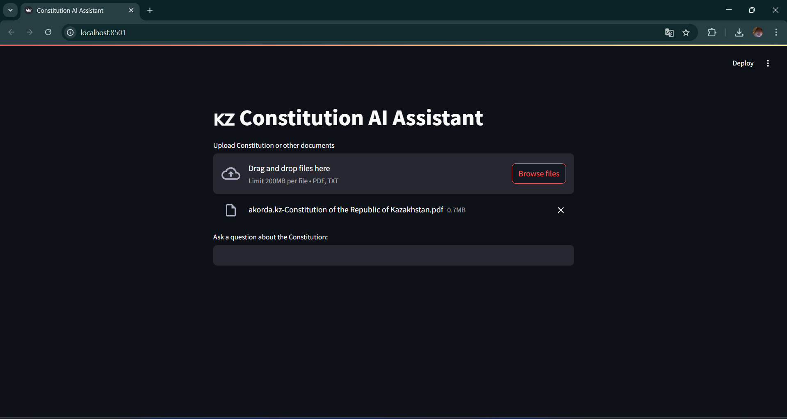
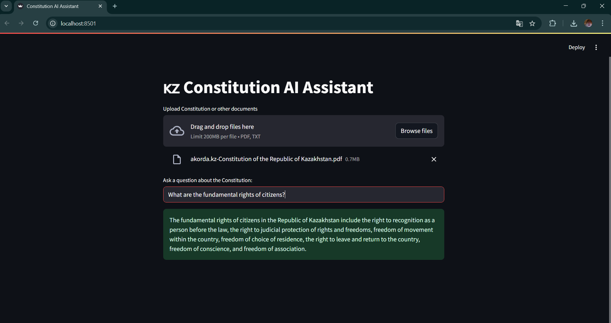

# 🇰🇿 Constitution AI Assistant

An AI-powered assistant that answers questions about the Constitution of the Republic of Kazakhstan and other uploaded legal documents using LLM + vector search (RAG).

---

## ✅ Features

- ✅ Upload multiple documents (PDF or TXT)
- ✅ Ask natural-language questions
- ✅ Uses OpenAI LLM with ChromaDB as a vector store
- ✅ Automatically splits, embeds, and indexes document chunks
- ✅ Context-aware answers from uploaded content
- ✅ Built with Streamlit (UI), LangChain (pipeline), and dotenv (for secrets)

---

## 📦 Setup Instructions

### 1. Clone the repository (or unzip folder)
```bash
git clone https://github.com/your-username/ai-constitution-assistant.git
cd ai-constitution-assistant
```

### 2. Install dependencies
```bash
pip install -r requirements.txt
```

### 3. Set your OpenAI API Key
Create a `.env` file in the root directory:

```
OPENAI_API_KEY=your_openai_key_here
```

Or rename `.env.example` to `.env`.

### 4. Run the app
```bash
python -m streamlit run main.py
```

---

## 🖼️ Screenshots

### Uploading documents


### Answering a question


---

## 🧪 Example Usage

Upload the official [Constitution of Kazakhstan (EN)](https://www.akorda.kz/en/constitution-of-the-republic-of-kazakhstan-50912) and ask:

> *"What are the fundamental rights of citizens?"*  
> *"What is the term length of the President?"*

---

## 📄 License

This project is licensed under the [MIT License](LICENSE).

---

## 🔗 References

- [LangChain Documentation](https://python.langchain.com/)
- [Streamlit File Uploader Docs](https://docs.streamlit.io/develop/api-reference/widgets/st.file_uploader)
- [ChromaDB + RAG Setup Guide](https://medium.com/@arunpatidar26/rag-chromadb-ollama-python-guide-for-beginners-30857499d0a0)
