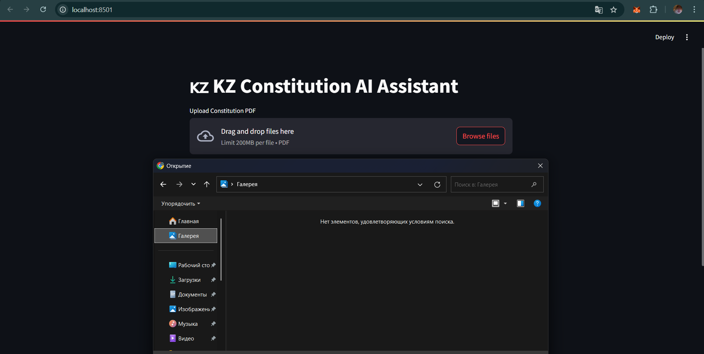
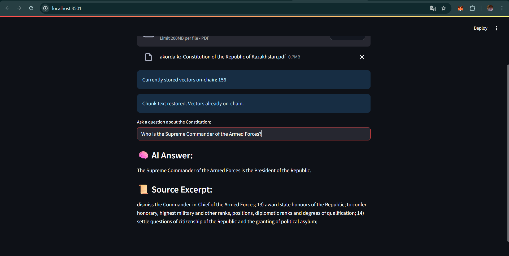
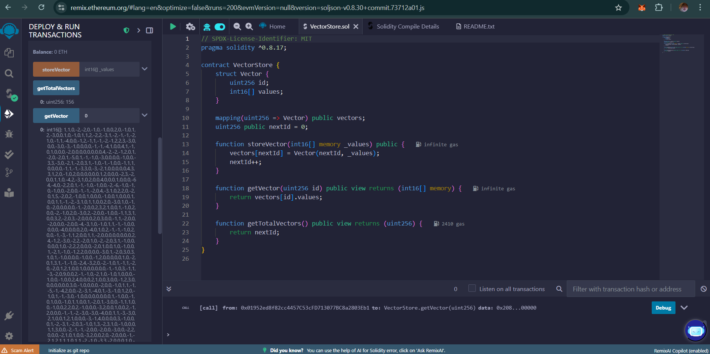

# 🇰🇿 Kazakhstan Constitution AI Assistant (On-Chain)

This project is a decentralized AI Assistant that can answer questions about the **Constitution of the Republic of Kazakhstan** using vectors stored **directly on the blockchain**. It combines OpenAI's embeddings, smart contracts written in Solidity, and a Streamlit interface.

---

## 🚀 Usage

### 1. Start Ganache
Run a local Ethereum blockchain using:
```bash
ganache
```

### 2. Deploy Smart Contract
- Open [Remix IDE](https://remix.ethereum.org)
- Paste and compile `VectorStore.sol`
- Deploy to `http://127.0.0.1:8545` (Custom HTTP Provider)
- Copy the deployed contract address

### 3. Update `.env`
```env
CONTRACT_ADDRESS=0xYourDeployedContractAddress
OPENAI_API_KEY=your-openai-api-key
```

### 4. Run Streamlit App
```bash
streamlit run main.py
```

---

## 📄 Features

- Upload a PDF of the Constitution
- Split into chunks using LangChain
- Generate OpenAI embeddings for each chunk
- Store all vectors **on-chain**
- Query the assistant: your question is embedded, compared to stored vectors, and answered by OpenAI using the best matching chunk(s)

---

## 📸 Screenshots

| Upload Document | Ask a Question | Remix Vector Check |
|-----------------|----------------|---------------------|
|  |  |  |

---

## 💬 Example

**Prompt:**  
> Who is the Supreme Commander of the Armed Forces?

**AI Response:**  
> The President of the Republic of Kazakhstan is the Supreme Commander-in-Chief of the Armed Forces, as stated in Article 44 of the Constitution.

---

## 🧠 Architecture

| Layer           | Tool               |
|----------------|--------------------|
| Smart Contract  | Solidity (VectorStore) |
| Blockchain      | Ganache (Local Ethereum) |
| Off-chain App   | Python (Streamlit + Web3.py) |
| Embeddings      | OpenAI (`text-embedding-ada-002`) |
| Document Parser | LangChain PDF Loader |
| Answering Model | OpenAI GPT-3.5 via LangChain |

---

## 🧪 Examples for Testing

- Who is the Supreme Commander of the Armed Forces?
- What are the powers of the President?
- How is citizenship defined?
- What does Article 7 state?

---

## 📄 License

This project is licensed under the [MIT License](LICENSE).

---

## 📎 Project Structure

```
├── main.py               # Main Streamlit app
├── send_vector.py        # Optional testing script
├── config.py             # Contains contract ABI
├── contracts/
│   └── VectorStore.sol   # Solidity smart contract
├── screenshots/          # Demo images
│   ├── upload.png
│   ├── query.png
│   └── remix_getVector.png
├── .env                  # Contract address & API key
├── LICENSE
└── README.md
```
